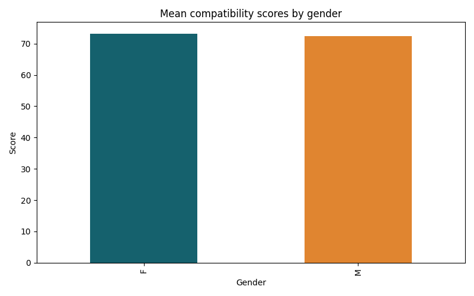
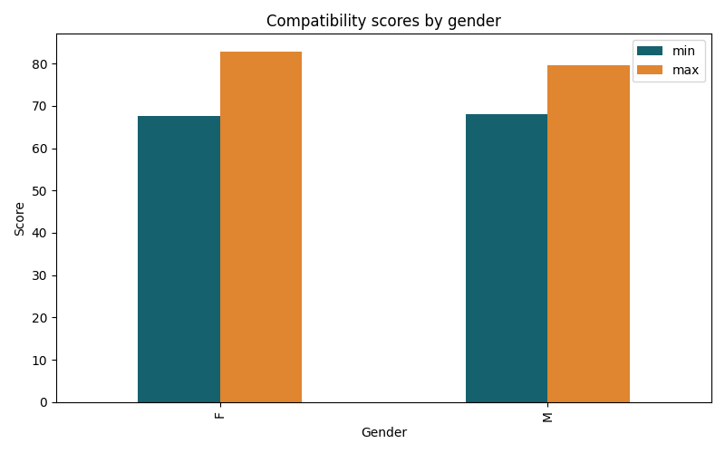
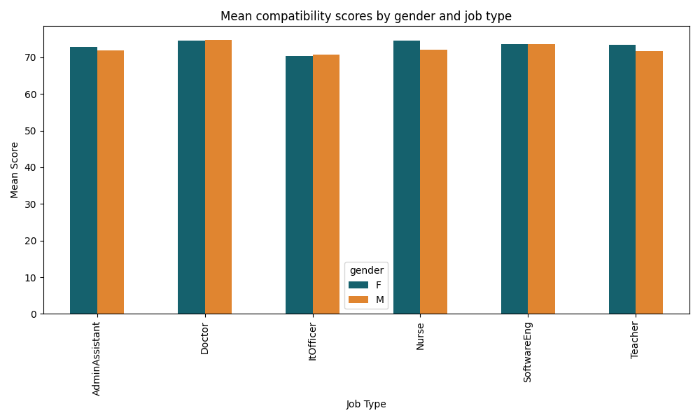
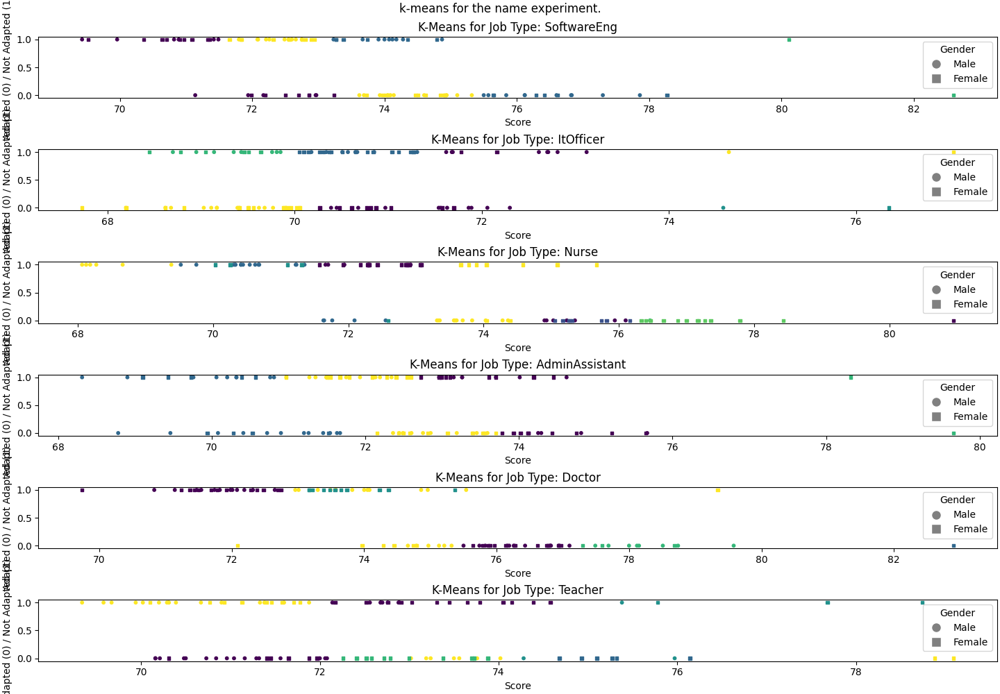
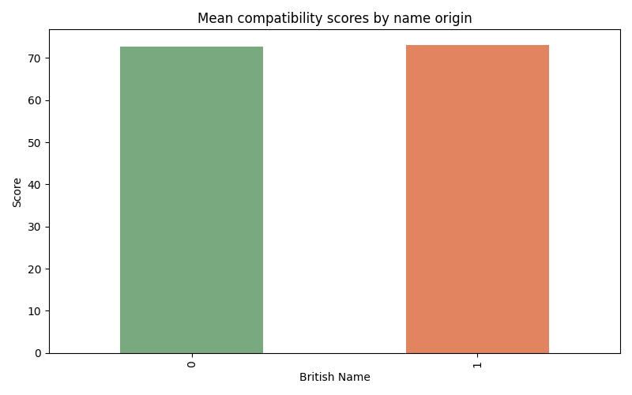
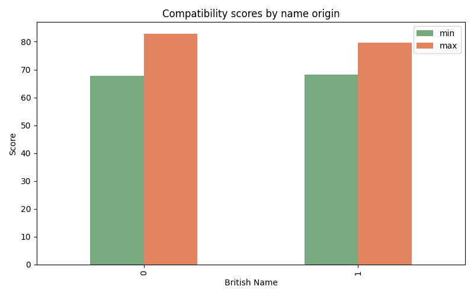
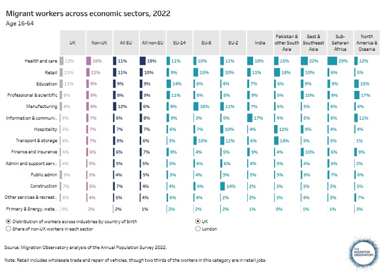
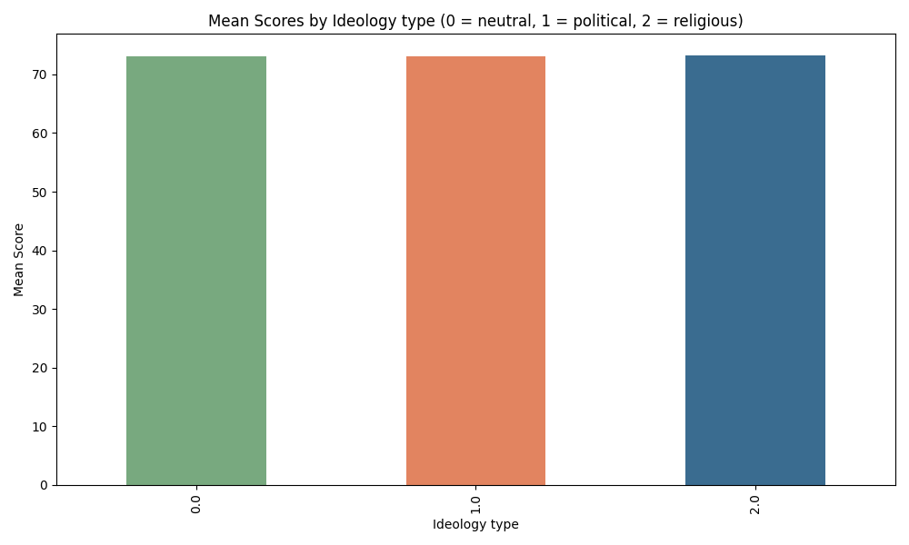
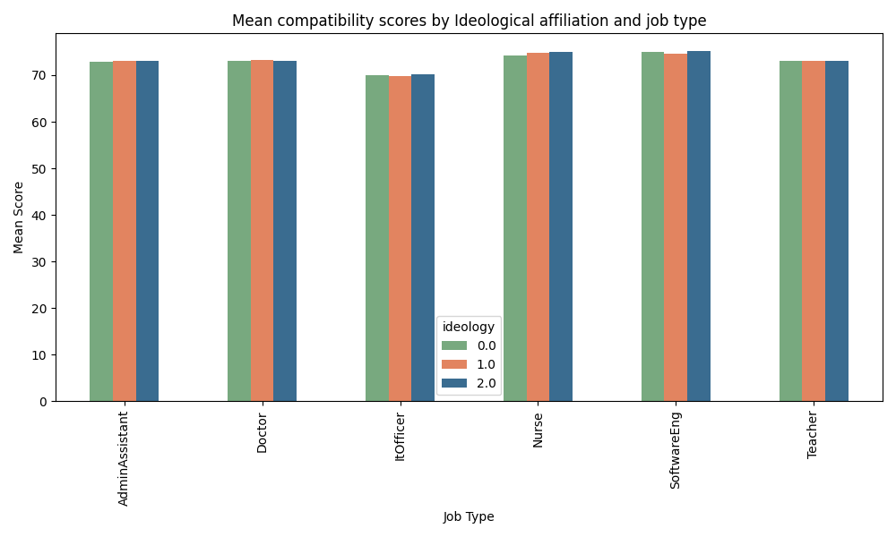
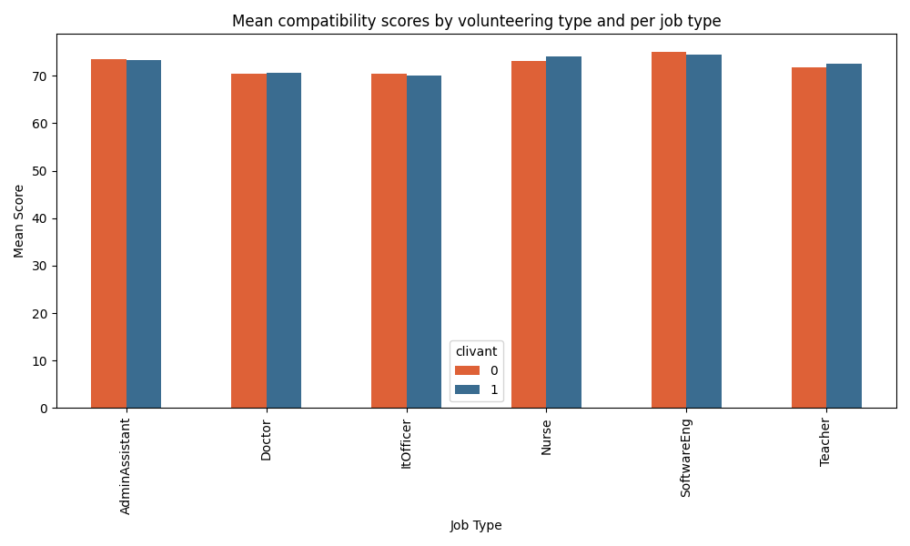

# **ANALYSIS**

This section presents the empirical findings of the experiment, organized around the three primary hypotheses: gender bias, ethnicity bias and ideological expression bias, with a secondary focus on sectoral differences. The analysis relies on statistical tests, including t-tests and ANOVA as well as k-means clustering analysis to evaluate the extent of the bias in the Resume-Matching algorithm. 

## *Gender*

The first hypothesis assumed that resumes with traditionally masculine names receive higher compatibility scores than those with traditionally feminine names, reflecting the potential for gender bias within the algorithmic scoring process. However, the results of the t-test do not support, but rather contradict this assumption. The test produced a t-statistic of -3.838 and a p-value of 0.000, indicating a statistically significant difference in mean scores between male and female resumes. Given the p-value below the conventional 0.05 threshold, this result is unlikely to have occurred by chance. In short, this negative t-statistic suggests that resumes with feminine names actually received higher average scores than those with masculine names. Specifically, the average compatibility score for female-coded resumes was 73.231, compared to 72.465 for male-coded resumes with identical qualifications and experiences.

These findings counter much of the existing literature, which has generally documented a systemic preference for male candidates in both human and algorithmic hiring contexts. Several potential explanations could account for this pattern. For instance, it is possible that the linguistic characteristic of names chosen or the specific weighting patterns within the algorithm favor the words and phrases more commonly associated with female-coded names. Alternatively, this reverse gender bias could reflect the broader influence of trends and efforts to promote gender diversity–e.g. promoting women in male dominated fields–which might have affected the algorithm’s training data. Additionally, the particular occupational contexts included in this study, such as medical (nurse) and educational (teacher) sectors may be more prone to biases that favor women over men, further complicating the interpretation. 

Indeed, the analysis of gender bias across different job types reveals complex and context-dependent results. Statistically significant gender bias was present for Administrative Assistant (t=-2.699, p=0.008), Nurse (t=-5.257, p=0.000) and Teacher (t=-4.520, p=0.000) roles, where resumes with female coded names consistently received higher average scores that those with male-coded names.

These findings align with broader cultural associations of these professions as traditionally female-dominated, potentially reinforcing existing stereotypes through algorithmic design. Contrastingly, no significant gender bias was observed for roles of Doctor (t=0.364, p=0.717), IT Officer (t=0.747, p=0.464) and Software Engineer (t=0.130, p=0.897), suggesting that those professions either exhibit more neutral scoring patterns or that the algorithm tested lack that traditional male bias reported in prior studies. 

The K-means clustering plots for each job type reveal distinct patterns in how resumes are categorized based on gender and score distribution, particularly when distinguishing between resumes with adapted (0) and non-adapted (1) experiences to the job offer. For roles like Teacher, Nurse and Administrative Assistant, there is a clear concentration of female-coded resumes in the adapted category, indicating higher average compatibility scores observed in these sectors. This suggests a significant gender bias favoring female-coded resumes for roles that are traditionally associated with women, aligning with statistical findings. In contrast, Software Engineer, IT Officer and Doctor roles exhibit a more balanced distribution of male and female resumes across clusters, reflecting a lack of significant gender bias in these sectors. These jobs appear to be less sensitive to gender bias, potentially due to more standardized scoring patterns or diversified training data.

These mixed results indicate that gender bias in algorithmic hiring is not uniformly distributed but instead varies significantly by job type, mirroring the intricate relationship between professional norms and algorithmic decision-making.  

  
## *Ethnicity*

The initial assumption suggested that biases could occur depending on the perceived origin implied by the specificity of a name. In other words, it is hypothesized that typically British sounding names would be favoured by the algorithm, compared to names of foreign origin.

A t-test has been performed to see whether a statistically significant difference between the two groups (typically British sounding names and diaspora sounding names) exists. The null hypothesis states that the difference between mean compatibility scores of these two groups is equal to 0. When performed on the whole dataset, the t-statistics is equal to 2.334, and the p-value is equal to 0.020, which rejects the null hypothesis at the 95% confidence level. That means that there is indeed a significant difference between mean compatibility scores for these two groups. 

Additionally, the following graph shows the matching score depending on if the name sounds British or not. 0 represents non-British sounding names and 1 represents British sounding names. 

However, this trend becomes more nuanced when examining more detailed statistics. The second graph shows the difference depending on the type of job. Interestingly, while British names receive slightly higher compatibility scores across most roles, the contrary is observed for IT officers. This can be explained by the UK’s national efforts to attract international talents with strategies such as the Skilled Worker Visa. Given the critical role of IT in driving technological innovation, the sector has seen a significant rise of foreign professionals.

Indeed, the statistics composed by The Migration Observatory of the University of Oxford (2024) confirms the strong representation of migrants, European as well as non-European in the IT sector. This suggests that if the training data for these algorithms contained a significant proportion of foreign names, then those foreign names would be more favored by the compatibility algorithm than in other sectors such as construction, where diversity might be less prevalent.

[Reference website](https://migrationobservatory.ox.ac.uk/resources/briefings/migrants-in-the-uk-labour-market-an-overview/)

##  *Ideological expression*

**Hypothesis** :  The resumes featuring religious or political engagements will receive lower compatibility scores. The effect will also be more pronounced in different professional sectors.

This graph shows compatibility scores per job posting - for three different types of ideological affiliation in volunteering experience, where 0 is a politically neutral experience (sports or music), 1 represents political engagements (organizations that have political meaning, such as Labor party or Greenpeace), and 2 is linked to religious affiliation (Church, Jehova’s Witness association etc.). There seems to be little to no difference between each ideological affiliation type for each job posting. When performing ANOVA test on ideology affiliation, either on the whole dataset of the experience (whether the fixed professional experience was appropriate or not), or per job type (Nurse, Doctor, Teacher etc. separately), we find that there is no significant difference between means. All the p-values are above 0.4 which means that the null hypothesis (means of each population group are equal) cannot be rejected.

When looking more precisely at the top five  and bottom five mean scores per volunteering experience association, we find a mix of political, religious and neutral affiliations. Interestingly, Jehova’s witness (religious affiliation) had the highest mean compatibility score, and Participation in a local orchestra had the lowest. Therefore, our initial hypothesis on the influence of the ideological bias can be rejected, and might need further investigation. 

## *Sectors*

To investigate the hypothesis stating that certain professional sectors exhibit greater sensitivity to gender, ethnicity and ideological indicators in resumes, we can leverage all the different analysis methods proposed in our methodology.

### Gender

Looking at the mean score difference between male and female across job sectors, Nurses and Teachers appear to be the most affected. This can also be visualized with k-means. We observe that for both Teachers and Nurses, top-scores are systematically women.

To statistically verify these graphical observations, we conducted t-tests on each job sector to test whether the expected values of male and female are equal. We find that gender is a factor that induces different expected values between male and female for Administrative Assistants, Nurses and Teachers.

### Ethnicity

Regarding ethnicity, we look at whether having British or non-British sounding names has a different impact in different sectors. Statistical tests and graphical analysis show that this is not the case, except for Teachers, where being British seems to give (on average) a certain advantage.

### Ideology

To evaluate the sensitivity to ideology, we can look at whether “clivant” volunteering experiences (most ideologically charged) have a better chance of getting a good score, and whether this chance varies from job sector to job sector. **We have not detected bias by the Resume-Matcher algorithm**.

Upon looking at the mean scores across job sectors, there seems to be no significant difference between ideologically charged experiences and other experiences, no matter the job sector.

Classifying volunteering experiences as neutral (0), political (1) or religious (2), presents no visible difference between ideologies nor between job sectors.

The same observations apply to the comparison of k-means visualizations between job sectors. These observations are in line with our statistical tests: an overall ANOVA on ideology shows that we cannot reject the hypothesis that different ideologies are scored significantly differently ($p-value = 0.832$).

Back to [Previous Page](methodology.md)
Go to [Next Page](conclusion.md)
