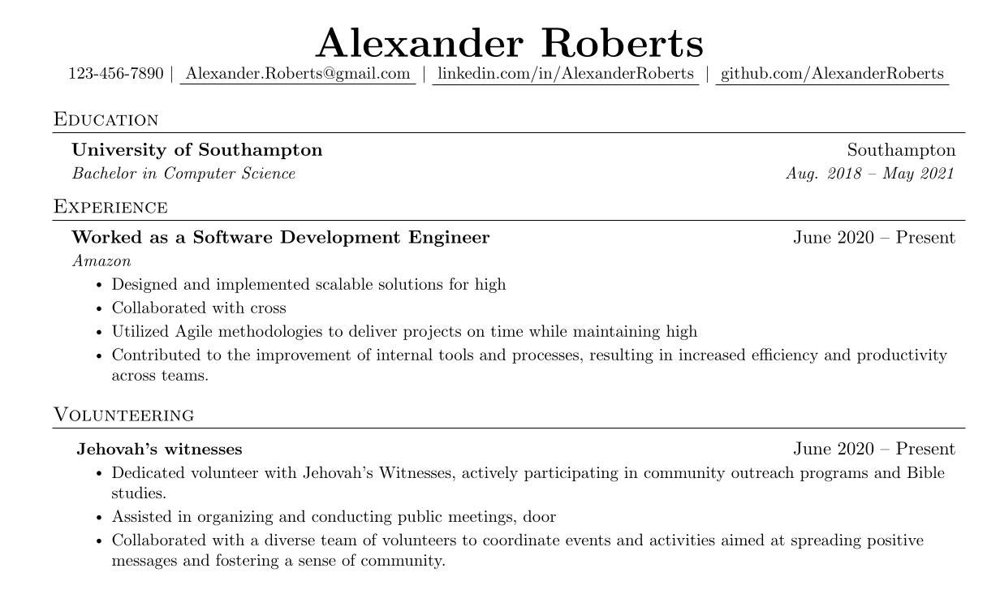
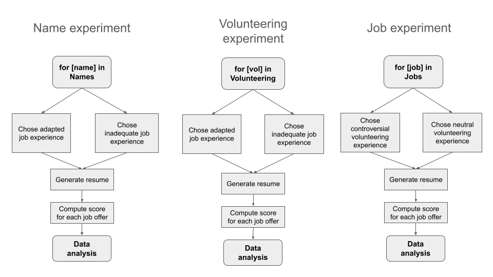
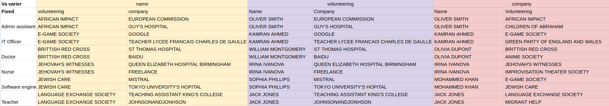

# **Methodology**

## *Research design and scope*

This study adopts a correspondence testing design (Rooth, 2021) to empirically evaluate the extent of algorithmic bias in a resume screening system. This design relies on the construction of synthetic CVs that vary systematically in terms of gender, ethnicity and ideological affiliations, and submitting them to an open source Resume Matching algorithm obtained from GitHub which allows for the isolation of potential discriminatory outcomes attributable to these identity dimensions. 

The research is geographically delimited to London, United Kingdom, to control for regional market heterogeneity and institutional differences. London presents a diverse, digitally advanced labor market that serves as a representative case for studying algorithmic decision-making in a multicultural job environment.

## *Operationalization of key variables*

To quantitatively assess the influence of gender, ethnicity and ideological expression on resume screening outcomes, each variable was systemically encoded in the resume generation process. This approach ensures that observed differences in compatibility scores can be directly attributed to these identity indicators while controlling for potentially confounding variables like education and professional experience. 

Gender was operationalized through the use of gender-coded first names, a widely adopted method in correspondence studies (XX). Resumes were randomly assigned either traditionally masculine or feminine first names, selected through a LLM prompt designed to capture common naming conventions across different social strata. 

Ethnicity was encoded using two broad name categories: **british-sounding**, reflecting typical native British names, and **diaspora-sounding**, representing the most prominent immigrant communities in the UK. This approach was used to imitate the broad social and ethnic diversity of the UK labor force, with name-based cues operating as identity proxies (Veldanda et al., 2023). Those names were generated using the following LLM (GPT-4o) prompts: 

1. Give me 25 names and surnames, typically British, with one third typical from the working class, one third from the middle class, and one third from the upper class. 
    
2. Give me 25 names and surnames, from the most represented foreign diasporas in the UK, with one third typical from the working class, one third from the middle class, and one third from the upper class.
    

  

Ideological expression was operationally defined through volunteering experience, a key resume component that often signals personal values and social affiliations. Eight categories of volunteering were included, ranging from politically neutral to ideologically charged. 

1. Medical assistance and rescue (e.g. British Red Cross, London Ambulance Service)
    
2. University associations (e.g. Asian Society, Improvisation Theater Society)
    
3. Religious organizations (e.g. Jewish care, The Children of Abraham Coalition)
    
4. Humanitarian work (e.g. Foodbank, Migrant help)
    
5. Sports (e.g. Parkour, Fencing Society)
    
6. Political involvement (e.g. the Labour Party, Green Party of England and Wales)
    
7. Music (e.g. Saint John’s Choir, Glastonbury Festival)
    
8. Environment (e.g. Greenpeace, Marine Conservation Volunteer)
    

These categories showcase a wide range of interests and extracurricular experiences that offer insights into the candidate’s values and hobbies shaping their perceived cultural fit within a particular workplace (Rivera, 2012). Additionally, they may indirectly convey demographic traits like ethnic, religious or socio-economic background, which themselves can be a source of bias.  

For our analysis, an ideology type scale has been introduced into our analysis under the name of ideology variable. Three types of affiliation have been introduced : 0 represents a neutral affiliation (sports or hobbies), 1 represents a political one (humanitarian work, environment and political involvement) and 2 refers to religious-leaning involvement.  

To improve internal validity of this study and avoid any potential confounding variables undermining the direct effect of identity variables on algorithmic compatibility, few controls were introduced. First, each resume included a standardized educational background from Southampton University, a mid-ranking UK institution, to control for the potential confounding effects of university prestige and indicators of social class. Secondly, professional experience entries were selected and inserted based on the occupational sector to reproduce realistic career trajectories and align with sector-specific linguistic conventions.  

## *Data generation*

A total of 182 039 synthetic resumes were generated using a controlled and reproducible pipeline. Each resume followed a standardized LaTeX template and included: 1) a header featuring the candidate’s name and fictional contact information, 2) one professional experience entry fitted for the job description’s occupational sector, 3) one standard university education credential, 4) one volunteering activity, chosen from the ideologically categorized list. Moreover, the experience on CVs was distributed across three sectors. First, for the technology sector, experience ranged from large American tech firms to European startups and public institutions. Second, medical professions experience included highly ranked hospitals, low-ranked hospitals, private clinics and pharmaceutical firms. Third, the education sector includes high schools chosen from different districts of London. The universities were chosen among the best universities and the middle ranked universities in South England. 

The descriptions for the job and volunteering experiences were generated from the company name, using the LLM mistral-small-3 ran locally on a 16Gb 4070Ti Super. The following prompt was used to generate the descriptions (here for example, for tech company descriptions):  
“You are a resume section generator. I will give you a characteristic. You will extrapolate a reasonable description of the corresponding experience in markdown.  
Output the result in markdown format. Do not write any "," or ";". Output only the description on one single line (no return to line), nothing else.  
The characteristic is: Job experience (Tech Company): {comp}”

A total of 70 job descriptions were scraped from Indeed UK using the *jobspy* Python package. Ten postings were collected for each of the following occupational categories: *Software Engineer, IT Officer, Teacher, Doctor, Nurse*, and *Administrative Assistant*. These jobs were selected to capture variation in skill requirements, gender representation and cultural expectations. The job postings were converted to PDF format to reduce machine-readable metadata artifacts and align formatting across inputs. 

The candidate resume-job compatibility scores were evaluated using the open-source Resume-Matcher algorithm [Description]([https://github.com/srbhr/Resume-Matcher](https://github.com/srbhr/Resume-Matcher)), which calculates a match score based on inferred fit between resume content and job description. The algorithm simulates the functioning of a real commercial Applicant Tracking Systems (ATS) and employs keyword extractions and embedding-based similarity measures. Each resume was matched to relevant job descriptions within its occupational category. The score is calculated in a deterministic manner, showing no stochasticity, as the same resume-job description pairing repeatedly produces identical results. 

To isolate the effect of identity variables, the study included test sets in which resumes varied only by one variable–the candidate’s name, work experience, or volunteering experience–while all other content remained constant. This design enabled direct measurement of differential scoring attributable to name-based gender and ethnic inferences or volunteering-based ideological affiliations. 

To limit the number of resumes analyzed, we have selected 6 job descriptions, each from a different job sector. For each of these job descriptions, we have led 3 experiments:

- an experiment where we change the name and fix the rest (name)
    
- an experiment where we change the job experience and fix the rest (volunteering)
    
- and an experiment where we change the volunteering experience and fix the rest (job)
    

Here is how resumes are being generated in each of these experiments:

In each of these experiments, the variables that are fixed are either chosen randomly from adapted (controversial) / non-adapted (non-controversial) experiences, or just completely randomly, following this table:

 

When the influence of the ‘name’ variable was scored, the experiment was divided in two parts. For each job type (Doctor, IT Officer etc.), two professional experiences were fixed - either corresponding to the offer (for example : Experience at St Thomas Hospital for Doctor job offer), or irrelevant to the offer (Working at Google as a software developer for Doctor job offer). Complementary volunteering experience was chosen randomly. Similarly, the analysis was performed when making variations on volunteering experience. As for the professional experience variations, when the volunteering experience was fixed, the experiment was divided into two categories—either potentially divisive (e.g., politically or socially sensitive) or neutral. First names were randomly assigned in all cases. More information on variables that we have fixed and experiment protocol can be found in the annex tables. 

## *Data Analysis*

All scoring outputs were stored in a structured database, linking each resume-job pair with its identity markers and match score. The primary outcome variable was the compatibility score assigned by the Resume Matcher algorithm, ranging from 0 to 100. 

The analysis of these results was then conducted in two phases. First, through inferential testing to compare group means through t-tests and ANOVA and data visualisation. Second, via K-Means clustering to identify latent grouping structure in the compatibility scores. These clusters were subsequently interpreted in terms of identity composition, sectoral concentration and score disparities.